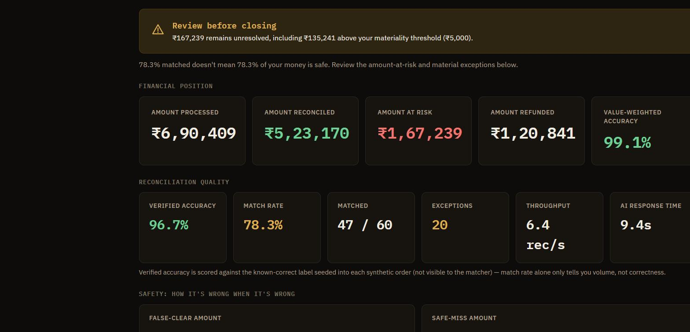
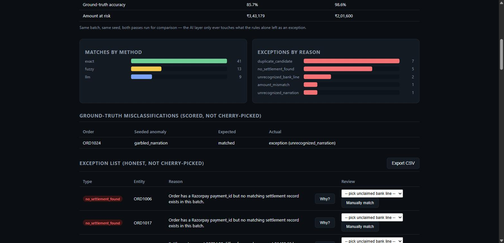
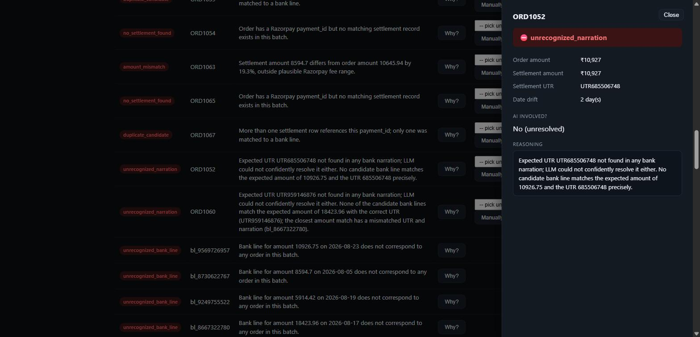

# ReconIQ

A multi-source reconciliation agent for the Razorpay AI Buildathon —
**Track 04: AI Finance Controller**.

**Live demo:** https://reconiq-mocha.vercel.app · **Repo:** https://github.com/Shaurya55555/reconiq



## What it solves

Merchants reconcile money across three places that never agree perfectly:
their own order ledger, the payment gateway's settlement export, and the
bank statement the money actually lands in. Fees shift amounts, dates
drift, UTR references get garbled by bank narration formats, and some
settlements just never show up. Today someone eyeballs a spreadsheet.

ReconIQ closes that loop automatically on a batch of orders:

1. **Exact match** — settlement UTR found verbatim in a bank line, amount
   matches to the paisa.
2. **Fuzzy match** — UTR found, but amount differs by a plausible Razorpay
   fee (≤3%) or the settlement date drifted.
3. **Beyond 1:1 — group matching, both directions.** ReconIQ handles
   1:1, **1:N**, and **N:1** (deliberately not claiming arbitrary
   many-to-many — see below for the precise distinction):
   - **1:N (split settlement):** one settlement's money didn't arrive as
     a single bank credit; it arrived as two or three separate lines (a
     partial early payout, the balance a day or two later, or a fee leg
     booked on its own) that all reference the same UTR.
   - **N:1 (batch settlement):** several orders' payments were
     consolidated by Razorpay into *one* settlement record and settled
     as one bank credit under one UTR — genuinely how Razorpay's batch
     settlement works, not a contrived scenario.

   Both resolve via deterministic, bounded combinatorial search — no AI
   involved, because the shared UTR is what proves the group belongs
   together, not a guess. This is the single most common reason
   commercial reconciliation tools still fail and get pushed back to
   spreadsheets: they handle 1:1 well and give up past that.
4. **LLM-resolved match** — the UTR isn't found in *any* bank line because
   the narration was truncated, prefixed with bank-specific noise, or had
   digits transposed. This is handed to an LLM (or an offline heuristic
   with no key configured) to reason over the free-text narration, amount,
   and date and propose a match — the one step a plain rules engine
   genuinely cannot do. The auto-accept confidence bar is a tunable
   parameter (`confidence_threshold`), not a hardcoded cutoff, because in
   production a finance-ops reviewer would want to set how conservative
   the auto-clearing is.
5. **Honest exceptions** — anything still unresolved is surfaced with a
   reason code (`no_settlement_found`, `amount_mismatch`,
   `duplicate_candidate`, `duplicate_order_reference`,
   `unrecognized_narration`, `unrecognized_bank_line`), never silently
   dropped.
6. **Human-in-the-loop override** — a reviewer can accept a shaky match,
   reject one back to an exception, or manually pair an exception with an
   unclaimed bank line via `POST /api/override`, logged distinctly as
   `human_override` in the audit trail so it's never confused with an
   automated decision.
7. **Bring your own data** — the same pipeline runs against uploaded
   `orders.csv` / `settlements.csv` / `bank_lines.csv` (`POST
   /api/run-upload`, or the dashboard's "Bring your own data" panel).
   Ground-truth accuracy is honestly omitted for uploaded data — there's
   no seeded truth label to score against — but match rate, amount at
   risk, and the exception list are still reported.
8. **Closing verdict, not just a pile of exceptions.** Every run adds a
   business-facing decision layer on top of the exception list: each
   exception is tagged with an amount-based `priority` (`high` /
   `medium` / `low`, relative to a tunable `materiality_threshold`, ₹5,000
   by default), and a `closing_verdict` synthesizes those into a single
   "Safe to close" / "Cannot close" call plus the total ₹ still
   unresolved. A finance controller doesn't need to read 40 exception
   rows to know whether the books can close today — the verdict banner at
   the top of the dashboard answers that directly. This is pure
   synthesis over already-computed data (no new matching logic, no new
   risk); it exists because the end user is a financer, not an engineer,
   and "can I close the books" is the actual question they're asking.
9. **Plain-English policy presets.** The three numeric matching knobs
   (`confidence_threshold`, `fee_tolerance_pct`, `date_drift_ok_days`)
   are exposed to non-technical users as three named presets —
   Conservative / Balanced / Automatic — instead of requiring someone
   who's never heard of a confidence threshold to guess at 0.6 vs. 0.8.
   The exact numeric values a preset maps to stay visible and editable in
   an "Advanced" panel, never hidden, so a technical reviewer (or a judge)
   can always see precisely what a preset means and override it.

## Beyond 1:1 matching, in more depth

Every reconciliation tool handles the case where one order maps cleanly
to one settlement and one bank line. Almost none of them handle it well
when that assumption breaks — and in practice it breaks constantly:
partial early settlements, a fee adjustment booked as its own ledger
line, a payout split across two bank working days, or several payments
consolidated into one batch settlement. That's routinely why finance
teams fall back to spreadsheets even with expensive tools in place.

**Precision on the claim:** this is 1:1, 1:N, and N:1 — deliberately
*not* advertised as "many-to-many." True many-to-many (several
settlements partitioned against several bank lines simultaneously) is a
harder combinatorial problem this project doesn't attempt, and claiming
it without having built it is exactly the kind of overclaim this README
tries to avoid everywhere else.

**1:N — `group_split` (settlement → many bank lines).**
`matcher._find_settlement_match` tries a single bank line first (exact,
then fuzzy). Only if that fails does it search combinations of up to
`MAX_GROUP_SIZE` (3) bank lines that already reference the *same
settlement UTR*, looking for a subset that sums to the settlement amount
within a paisa.

**N:1 — `batch_settlement` (many orders → one settlement → one bank
line).** Modelled the way Razorpay's settlement API actually behaves —
one real settlement row carries a `payment_ids` list covering several
orders' payments, settled as one bank credit under one UTR — rather
than contriving a bank narration that somehow embeds several UTRs
(banks don't produce statements like that). `matcher.reconcile` indexes
each settlement under every payment_id it covers, resolves each batch
group as a single unit against the bank statement, then emits one match
record per member order, all pointing at the same settlement and bank
line. If a batch's member amounts don't actually sum to the settlement's
reported total, that's a genuine discrepancy and surfaces as an honest
exception — never silently accepted.

Both directions are deliberately classical combinatorial/lookup logic,
not an LLM call: exact-sum arithmetic is a problem bounded search solves
exactly and quickly, and handing it to a language model would be slower
and less reliable for no benefit. The shared UTR (or shared settlement
record) is what proves the group belongs together — the LLM stays
reserved for the genuinely ambiguous case (narration text with no UTR
match at all), consistent with the same "rules first, AI only where
rules truly can't" principle used everywhere else in this project.

Verified: at seed 99 / 200 orders, every `split_settlement`-seeded order
resolves via `group_split`, and every `batch_settlement`-seeded order
resolves via `batch_settlement`, both with zero misclassifications and
entirely in the rules pass — the AI layer never needs to see either
case. 8 real batch groups (sizes 2–3) formed correctly in that run.

## Value-weighted accuracy, and the two ways to be wrong

Transaction-count accuracy ("96% correct") treats a ₹200 order and a
₹2,00,000 order identically. `scoring.py` also reports **value-weighted
accuracy** (`amount_accuracy` in the API) and splits the wrong 4% into
two failure modes that are not equally bad. A precision note on the
name: this is order-level decision correctness weighted by rupee amount
— it is not a claim that money was physically verified moving correctly,
which is a stronger statement than what's actually measured here.

- **False clear** — confidently wrong: matched when it should have been
  an exception. The dangerous failure — money moves that shouldn't have.
- **Safe miss** — conservative: excepted when it should have matched.
  Money just sits flagged for review instead of moving wrong.

**Bounded claim, not a guarantee:** across the corruption-rate benchmark
sweep (`POST /api/benchmark`, batches at 10/20/30/40/50% corruption,
rules-only and rules+AI both measured on each) run against the live
deployment, false-clear amount was **₹0 at every corruption level
tested**. That means every mistake the system made in these runs was a
safe miss (flagged for review), never a confident wrong match — but it's
an empirical result over the batches actually run, on synthetic data
whose thresholds were tuned alongside the generator (see the honesty
note below), not a mathematical guarantee that holds for arbitrary
real-world noise or an adversarial input.

## Rules-only vs. rules+AI, same batch

`POST /api/run` also runs a rules-only counterfactual (the LLM stage
skipped entirely) alongside the real pass, so the dashboard can *show*
what the AI layer contributes instead of asserting it. One real run:

```
                    Rules only   Rules + AI
match rate             82.9%        91.4%
ground-truth accuracy  91.4%       100.0%
amount at risk        ₹3,57,802   ₹1,56,903
```



The AI layer only ever touches what the rules alone left as an
exception — it doesn't get a chance to make a clean rule-based decision
worse.

Every decision, at every stage, is written to an audit trail: which
record, which method decided it, at what confidence, and why. The
dashboard can export both the exception list and the audit trail as CSV,
so the "honest exception list" claim is independently checkable, not just
asserted on screen.

## Two numbers, and why they're both reported

- **Match rate** — how much of the batch got auto-resolved. Tells you
  volume.
- **Ground-truth accuracy** — every synthetic order is seeded with a
  known-correct label (`clean`, `fee_adjusted`, `missing_settlement`, …)
  that the matcher never sees; `backend/app/scoring.py` grades the
  matcher's actual output against that label. Tells you correctness.

A high match rate with low ground-truth accuracy would mean the matcher
is confidently wrong — the failure mode "one cherry-picked match proves
nothing" is warning about. Reporting only match rate would hide that;
ReconIQ reports both.

**Honesty check on that accuracy number:** the fee-tolerance and
date-drift thresholds in `matcher.py` and the anomaly ranges in
`data_gen.py` were authored by the same person, together — so a
consistently high ground-truth score here demonstrates the *pipeline is
internally consistent* (its thresholds correctly separate the anomaly
classes they were designed against), not that it's zero-error against
arbitrary real-world noise. A real merchant integration would need those
thresholds tuned against that merchant's actual fee schedule and
settlement timing, not the constants shipped here.

## Sample runs

**Offline heuristic (no LLM key, 100 orders, seed=5):**

```
match_rate:            0.83   (63 exact, 7 fuzzy, 13 heuristic-resolved)
ground_truth_accuracy: 1.00
exception_count:       30     (10 amount_mismatch, 10 unrecognized_bank_line,
                                7 no_settlement_found, 3 duplicate_candidate)
throughput:             ~19,000 records/sec (in-process, no I/O)
```

Reproduce with `POST /api/run {"n_orders": 100, "seed": 5}`.

**Real Gemini (`gemini-flash-lite-latest`, 80 orders, seed=8), from the live deployment:**

```
match_rate:            0.8625  (4 of the garbled-narration cases resolved by the LLM)
ground_truth_accuracy: 0.9875  (1 of 80 -- see below)
```

The one miss: order `ORD1070` (seeded as `garbled_narration`, i.e. it
*should* have been resolvable) came back as an `unrecognized_narration`
exception instead of a match — Gemini declined to guess rather than
propose a low-confidence match. That's arguably the *correct* behavior
for a finance system even though it counts against the accuracy score
here: an honest "I don't know, here's why" beats a confident wrong match,
which is the entire thesis of this project. Included here rather than
cherry-picking the earlier all-heuristic 100% run, since a slightly
imperfect number backed by a genuinely explainable miss is more credible
than a suspiciously clean one.

Reproduce with `POST /api/run {"n_orders": 80, "seed": 8}` against a
deployment with `LLM_PROVIDER=gemini` configured.

**Scale test (1,000 orders, seed=42, real Gemini, run locally):**

```
elapsed:                187.2s   (5.3 records/sec, dominated by ~65 sequential Gemini calls)
match_rate:              0.865   (587 exact, 213 fuzzy, 65 llm)
ground_truth_accuracy:   0.99
amount_accuracy:         0.9897
false_clear_amount:      ₹0
safe_miss_amount:        ₹1,30,390
exception_count:         231
```

**Honest limitation this surfaced:** the same 1,000-order request against
the *live Vercel deployment* times out — a serverless function has a
duration cap, and ~65 sequential LLM calls at real network latency
exceeds it. Run locally (no serverless limit) it completes fine, at the
throughput above. This is a real, known constraint, not glossed over: the
deployed demo is sized for the batches shown throughout this README
(≤100–150 orders); a production version would parallelize the LLM
resolution calls rather than run them sequentially, or move long batches
to a background job instead of a request/response cycle.

## Why this design (not just a rules engine with a chatbot bolted on)

The deterministic passes exist because a match rate you can't defend
under questioning is worthless — "honest metrics" was explicit in the
brief. The LLM only runs on the residual the rules provably cannot solve
(garbled narration text), so it's doing real reasoning work, not
narrating what a SQL join already found. See `backend/app/matcher.py`
for the pass order and `backend/app/llm_resolver.py` for the resolver
and its offline fallback.

**Being honest about the offline fallback's limits:** with no
`LLM_PROVIDER` configured, both the exception-resolver and the "ask about
this run" chat run on deterministic heuristics (digit-similarity scoring;
keyword-matched question answering), not a model. That's a legitimate
fallback — the app is fully functional and the reasoning is real, just
weaker — but it should never be presented as "the LLM reasoning" in a
demo unless a provider key is actually configured. **The live deployment
does have a provider configured** (`LLM_PROVIDER=gemini`,
`gemini-flash-lite-latest`) — the exception resolution and chat answers
you get from the hosted demo are genuine model calls, verified against
the live API, not the heuristic. The heuristic path stays as a real,
tested fallback for offline/no-key use, and both are covered above.

## Per-decision evidence

Every match or exception has a "Why?" drill-down showing the full
lineage — order, settlement, and bank-line amounts, UTR vs. narration,
date drift, whether AI was involved, and the actual reasoning. Below: a
real case where Gemini correctly *declined* to guess on a garbled
narration rather than propose a low-confidence match — an honest
`unrecognized_narration` exception instead of a wrong clear.



## Architecture

```
data_gen.py  --generates-->  orders, settlements, bank_lines (in-memory batch)
                                        |
                                        v
matcher.py   --pass 1/2 (rules)-->  matches, needs_llm, exceptions
                                        |
                                        v
llm_resolver.py --pass 3 (LLM/heuristic)--> resolved matches or final exceptions
                                        |
                                        v
scoring.py   --grades matches/exceptions against each order's seeded truth-->
                                  ground_truth_accuracy, misclassified rows
                                        |
                                        v
FastAPI (main.py) --stateless response--> summary, matches, exceptions,
                                          audit trail, ground truth, chat Q&A
                                        |
                                        v
frontend/index.html (static dashboard, no build step)
```

`llm_resolver.py` is provider-pluggable via `LLM_PROVIDER`
(`openai` / `anthropic` / `gemini` / `ollama`); with none configured it
runs a deterministic offline heuristic (amount match + digit-sequence
similarity) so the whole app works with zero API keys.

The API is deliberately **stateless**: `POST /api/run` returns the full
result (summary, matches, exceptions, audit trail, ground truth) in one
response, and `POST /api/ask` takes the run's summary/exceptions back in
the request body rather than looking them up server-side by ID. This is
what lets the identical code run unmodified on a long-lived `uvicorn`
process locally and on a cold-starting serverless function on Vercel —
there's no shared memory to lose between invocations because nothing
depends on it.

## Running it

**Locally:**

```bash
cd backend
python -m venv .venv && .venv\Scripts\activate   # or source .venv/bin/activate
pip install -r requirements.txt
uvicorn app.main:app --reload
```

Open `http://127.0.0.1:8000/`, click **Run reconciliation**. Optionally
copy `backend/.env.example` to `backend/.env` and set `LLM_PROVIDER` +
an API key to use a real model for the exception-resolution and Q&A
layers instead of the offline heuristic.

**With Docker:**

```bash
docker compose up --build
```

**Tests:**

```bash
cd backend
pytest tests -q
```

## What broke, and how I got out of it

The synthetic-data generator originally created `amount_mismatch` records
with a fixed absolute drift (₹50–400). For small orders that's clearly
outside any fee range, but for a large order (say ₹20,000) a ₹400 drift
is under the 3% fee-tolerance band the matcher uses — so the matcher
correctly classified those as *fuzzy fee-adjusted matches* instead of
*exceptions*, and a test written to check "amount mismatches must never
silently match" failed. The bug was in the data generator conflating an
absolute rupee drift with a percentage-of-amount drift; fixed by
generating the mismatch as a percentage (6–20%) of the order amount,
which is guaranteed to exceed the fee-tolerance band regardless of order
size. Left the failing test in `backend/tests/test_matcher.py` as
`test_amount_mismatch_is_flagged_not_silently_matched` — it's the one
that would have caught this in a real batch before a human noticed a
mismatched exception silently marked "matched."

A second, subtler one surfaced during review, not by a test failing: the
matcher grouped orders by `razorpay_payment_id` and only ever reconciled
`orders_for_payment[0]` — if two orders had ever shared a payment_id
(impossible in this synthetic generator's random ID space, but not
impossible in general), every order after the first would vanish from
both `matches` and `exceptions` with no trace. Exactly the silent-drop
failure mode this whole project exists to prevent, sitting live in the
code that was supposed to prevent it. Fixed by explicitly emitting a
`duplicate_order_reference` exception for every order past the first in
such a group, and added
`test_duplicate_payment_id_across_orders_is_an_explicit_exception_not_a_silent_drop`
to keep it caught.

## Stack

Python / FastAPI backend, no database (in-memory run store for local
convenience — the API itself doesn't depend on it, see Architecture
above), static HTML/JS dashboard (no build step, so nothing to break on
someone else's machine during judging), deployed to Vercel as a Python
serverless function.

## Configuration reference

| Setting | Where | Default | Notes |
|---|---|---|---|
| `LLM_PROVIDER` | env | unset (offline heuristic); live deployment sets `gemini` | `openai` \| `anthropic` \| `gemini` \| `ollama` |
| `LLM_MODEL` | env | provider-specific | override the specific model used |
| `LLM_CONFIDENCE_THRESHOLD` | env, or `confidence_threshold` in the `/api/run` request | `0.6` | auto-accept bar for an LLM-proposed match |
| `FEE_TOLERANCE_PCT` | constant in `matcher.py`, or `fee_tolerance_pct` request field | `0.03` | would be per-merchant configurable in production, not a hardcoded constant, since real fee schedules vary by payment method and merchant category |
| `DATE_DRIFT_OK_DAYS` | constant in `matcher.py`, or `date_drift_ok_days` request field | `3` | same — real settlement SLAs vary by bank and settlement cycle |
| `materiality_threshold` | `/api/run`, `/api/run-upload`, `/api/override` request field | `5000` (₹) | exception ₹ amount above which it's tagged `priority: high` and blocks the closing verdict |

## Roadmap — what's deliberately not built, and why

**Deepening the existing loop (the direction this would grow in):**

- **Empirical confidence-threshold calibration.** `LLM_CONFIDENCE_THRESHOLD`
  (default `0.6`) is a reasonable starting point, not an empirically
  justified one. The right next step is a threshold sweep (0.5 → 0.9)
  against the hidden ground truth, reporting coverage vs. false-clear
  rate at each point, to pick a value that's actually defensible rather
  than asserted. Not built yet — flagged rather than faked.
- **Multi-seed corruption benchmark.** The current benchmark runs one
  batch per corruption level; averaging several seeds per level (with a
  spread, not just a mean) would make the "not cherry-picked" claim
  statistically tighter.
- **Parallelizing LLM resolution calls.** The 1,000-order scale test
  above found the real ceiling: ~65 sequential Gemini calls take long
  enough to exceed Vercel's serverless duration cap. Batching those
  calls concurrently (or moving large batches to a background job
  instead of the request/response cycle) would raise that ceiling
  without changing the matching logic itself.
- **Per-merchant persisted policy.** `fee_tolerance_pct` /
  `date_drift_ok_days` are request-level parameters today; a real
  deployment would persist these per merchant (real fee schedules and
  settlement SLAs vary by payment method and bank), not re-supply them
  on every call.
- **True many-to-many.** Both group-matching directions are now built:
  1:N (`group_split` — one settlement, many bank lines) and N:1
  (`batch_settlement` — many orders, one settlement, one bank line).
  Arbitrary many-to-many (several settlements partitioned against
  several bank lines simultaneously) is a meaningfully harder
  combinatorial problem and isn't attempted — the two directions built
  cover the realistic cases; true N:M is noted here rather than
  quietly implied.
- **Refund/chargeback-aware reconciliation.** A settlement that's
  already matched can later be partially or fully clawed back by a
  refund. Preserving that lineage (original settlement → refund →
  net-retained amount) rather than treating the later bank debit as an
  unrelated anomaly is the next concrete extension — not built yet.

**Explicitly out of scope — deliberately not built, not a gap:**

Cash-position/cash-forecasting, reconciliation aging as a standalone
view, a general-purpose finance chatbot, payroll, invoicing, tax
workflows, expense management, or any other accounting product. Track 4
asks for one finance-ops loop done credibly — throughput, measured
accuracy, honest exceptions — not a broader finance suite. Every one of
those would dilute that story rather than strengthen it; rejected on
purpose, not for lack of time.
